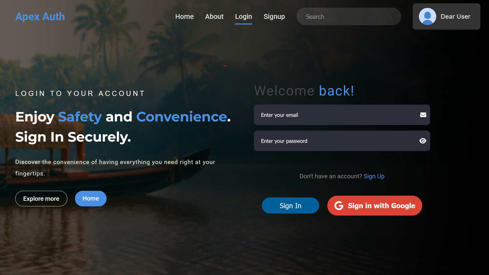
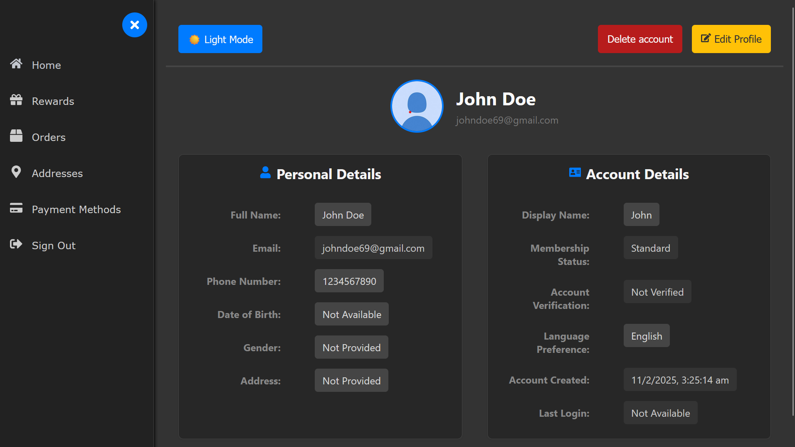
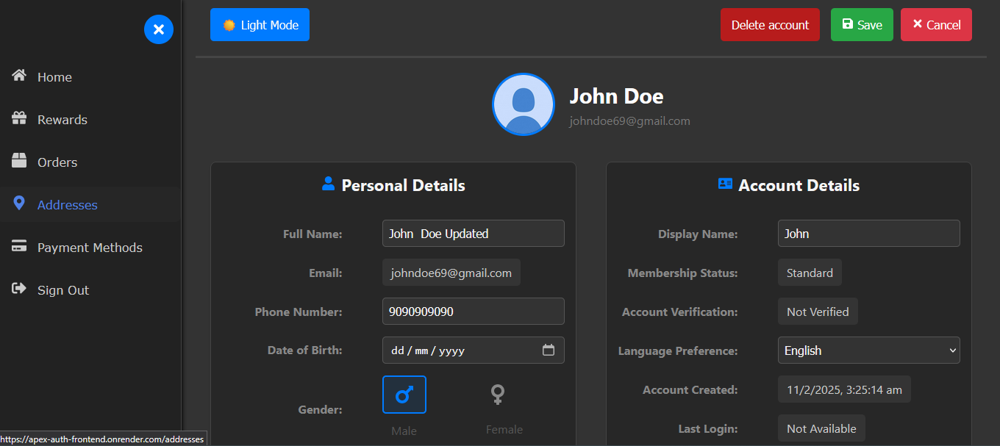
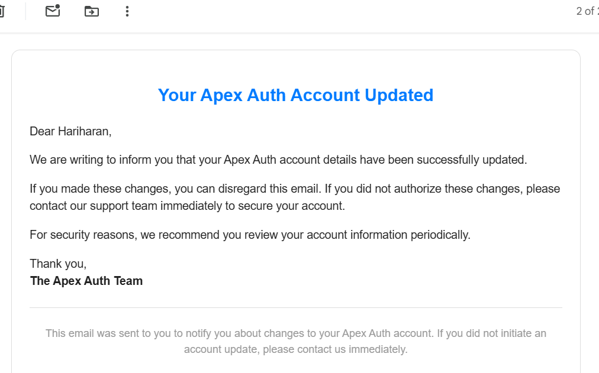
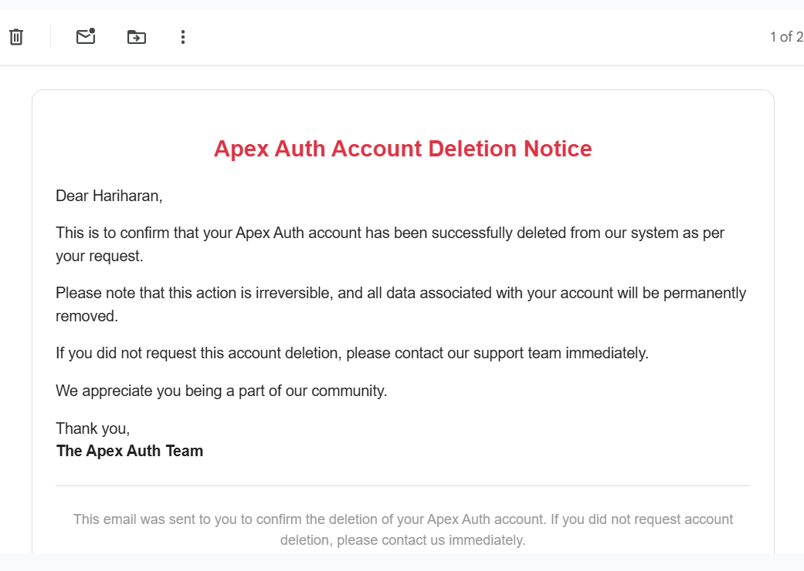

# 🚀 Apex Auth – Secure Authentication System

[](https://github.com/your-github-username/your-repo-name)
[](https://apex-auth-frontend.onrender.com/)

<p align="center">
  
</p>

<p align="center">
  ✨ <strong>Apex Auth: Modern, Secure Authentication for Web Applications.</strong> ✨
</p>

---

## 📝 Project Description

Apex Auth:  Secure, Scalable, Authentication.  Built for modern web applications, this system provides a complete and robust authentication solution, encompassing JWT, Google OAuth, HTTP-only cookies, bcrypt, and email notifications.  With a decoupled React frontend and Node.js backend, Apex Auth delivers a secure RESTful API, ensuring performance, maintainability, and ease of integration so you can focus on building your application's core features.

---

## 🛠️ Tech Stack - [MERN]

*   **Frontend:** React, CSS Modules, Redux, Fetch API, Toast Notifications
*   **Backend:** Node.js, Express.js, MongoDB, Mongoose, JWT, bcryptjs, Nodemailer, CORS, dotenv

---

## ✨ Key Features

### 🔒 Secure Authentication  
Apex Auth provides a secure and seamless authentication experience:  
- **User Registration & Login** – Secure account creation and authentication.  
- **Google OAuth Authentication** – One-click sign-in via Google for convenience.  
- **JWT-Based Authentication** – Ensures stateless authentication with JSON Web Tokens.  

---

### 🔑 Robust Password Handling  
Apex Auth enforces strong password security with the following criteria:  
✔️ Minimum **8 characters**.  
✔️ At least **one uppercase letter (A-Z)**.  
✔️ At least **one lowercase letter (a-z)**.  
✔️ At least **one number (0-9)**.  
✔️ At least **one special character** (`!@#$%^&*`).  

#### 🔐 bcrypt Hashing  
- All passwords are **hashed** before storage using **bcrypt**.  
- Hashed passwords are **irreversible**, protecting against data breaches.  
- Prevents brute-force and dictionary attacks.  

---

### 🍪 Session Management  
Apex Auth secures session handling using:  
- **HTTP-only Cookies** – Prevents access to authentication tokens via JavaScript.  
- **JWT Authentication** – Provides a secure, stateless authentication mechanism.  
- **Token Security** – Ensures tokens are safely stored in cookies to prevent unauthorized access.  

---

### 📧 User Engagement  
Apex Auth enhances user interaction with real-time notifications and emails:  
- **📩 Welcome Emails** – Users receive a confirmation email upon registration.  
- **🔄 Account Update Notifications** – Email alerts for profile modifications.  
- **🔔 Toast Notifications** – Real-time feedback for login, errors, and profile updates.  

---

### 🛡️ Security Best Practices  
Apex Auth is built with industry-leading security implementations:  
- **CSRF & XSS Protection** – Safeguards against malicious web attacks.  
- **Secure Cookies (`HttpOnly`, `Secure`, `SameSite`)** – Ensures authentication tokens remain protected.  
- **CORS Handling** – Restricts API access to prevent unauthorized requests.  

---

### 👤 Profile Management  
Users have complete control over their accounts:  
- **📄 View Profile** – Access and review personal details.  
- **✏️ Update Profile** – Modify and update user information securely.  
- **🗑️ Delete Account** – Permanently remove an account upon request.  

---

## 🌐 Live Demo

🔗 **[Try Apex Auth](https://apex-auth-frontend.onrender.com/)**  
📽️ **[Watch the Demo Video](https://drive.google.com/file/d/1iIN_XhINoLmgl_7xVl6faaj4rY3e2-A1/view?usp=sharing)**  


---

## 📸 Screenshots

| Feature             | Screenshot                                  |
| ------------------- | ------------------------------------------- |
| **Login/SignIn**    |            |
| **Register/SignUp** |             |
| **Profile View**      |             |
| **Edit Profile**      |    <br>            |
| **Account Deletion**  |           |

> 💡**Tip:** All images are available in the Screenshots folder for reference.

---

## 🏗️ Project Architecture

```bash
ApexAuth/
├── frontend/        # React frontend
│   ├── src/
│   ├── public/
│   └── ...
│
├── backend/         # Express backend
│   ├── routes/
│   ├── models/
│   ├── controllers/
│   ├── middleware/
│   ├── config/
│   └── ...
│
├── .env             # Environment variables
├── README.md        # Documentation
├── package.json     # Dependencies
└── ...
```

---

## 🚀 Getting Started

### ⚙️ Prerequisites

*   **Node.js (v18+)**: [Download](https://nodejs.org/)
*   **npm or yarn**: [Install Yarn](https://yarnpkg.com/getting-started/install)
*   **MongoDB (Local or Atlas)**: [Setup MongoDB](https://www.mongodb.com/docs/manual/installation/)

### 🔧 Installation

**Clone the Repository:**

```bash
git clone https://github.com/Kaushik-23-2003/Apex-Auth.git
cd Apex-Auth
```

**Frontend (React):** http://localhost:5173

```bash
cd frontend
npm install   # or yarn install
npm run dev   # or yarn dev
```

**Backend (Node.js + Express):** http://localhost:5000

```bash
cd backend
npm install   # or yarn install
# Create .env in backend/ and configure variables
npm run dev   # or yarn dev
```

**Backend .env Configuration:**

```bash
PORT=5000
NODE_ENV=development
MONGO_URI=your_mongodb_connection_string
JWT_SECRET=your_jwt_secret
FRONTEND_URL=http://localhost:5173
SENDER_EMAIL=YOUR_EMAIL@example.com
SENDER_EMAIL_PASSWORD=YOUR_EMAIL_PASSWORD
```

---

## 🔗 API Endpoints

| Method | Endpoint             | Description             |
| ------ | -------------------- | ----------------------- |
| `POST` | `/api/auth/register` | User registration       |
| `POST` | `/api/auth/login`    | User login              |
| `GET`  | `/api/auth/logout`   | Logout user             |
| `GET`  | `/api/user/profile`  | Get user profile        |
| `PUT`  | `/api/user/update`   | Update user profile     |
| `DELETE`| `/api/user/delete`  | Delete user account     |

> **Full API Documentation:** Check `backend/routes/` for detailed API specifications.

---

## 🛠 Development & Contribution

### 🤝 Contributing Guidelines

1.  Fork the repository.
2.  Create branch: `git checkout -b feature/new-feature`
3.  Commit changes: `git commit -m "Add: New feature"`
4.  Push branch: `git push origin feature/new-feature`
5.  Open a **Pull Request**.

---

## 📞 Contact

👤 **Hariharan Kaushik** - Project Creator

📧 **Email:** kaushikhariharan2003@gmail.com

🌐 **Live Demo:** [Apex Auth](https://apex-auth-frontend.onrender.com/)

---
